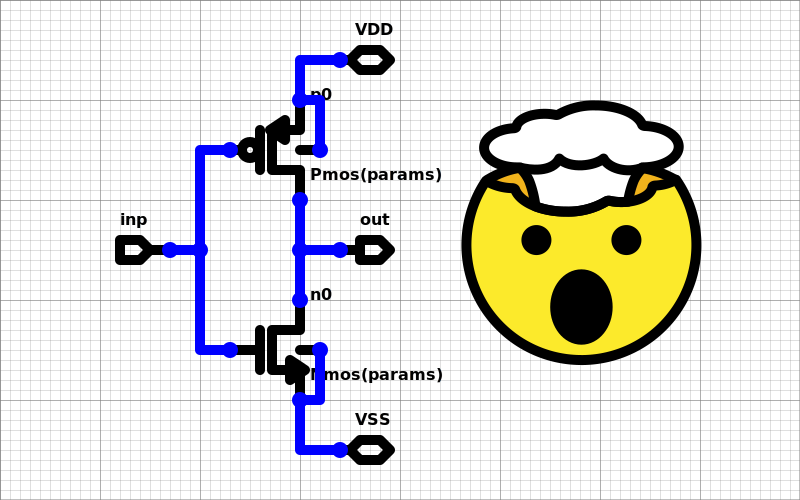
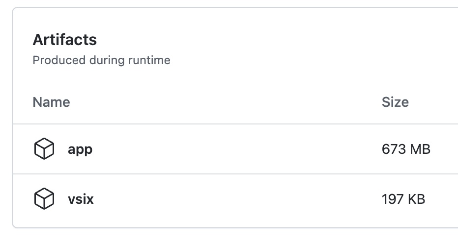

# Hdl21 Schematics

SVG based integrated circuit schematics that seamlessly import and run as [Hdl21](https://github.com/dan-fritchman/Hdl21)'s Python circuit generators.

_Jump to [Installation](#installation)_ | _[Development](#dev-quickstart)_

---

[Schematics](https://en.wikipedia.org/wiki/Circuit_diagram) are graphical representations of electronic circuits. In integrated circuit (IC, silicon, chip) design they the _lingua franca_ for analog circuits, and also commonly used for transistor-level digital circuits.

In short: schematics are two things -

1. A Circuit
2. A Picture

## Hdl21 Schematics are SVG Images

[Scalable Vector Graphics (SVG)](https://developer.mozilla.org/en-US/docs/Web/SVG) is the W3C's open web-standard for two dimensional vector graphics. SVG is an XML-based markup language which all modern browsers natively render, and includes the capacity for semi-custom content structure and metadata.

Hdl21 schematics are not _like_ SVGs.  
They are not _exportable to_ or _convertable to_ SVGs.  
They **are** SVGs. So:

- Each schematic is a _single file_. No dependencies, no linked "database".
- Anyone can read them.
- GitHub can read them.
- GitLab can read them.
- Grandma's copy of Internet Explorer can read them.

[This inverter](./docs/inverter.svg) is a valid schematic:


And [the same inverter](./docs/inverter_mind_blown.svg) with [OpenMoji's mind-blown emoji](https://openmoji.org/library/emoji-1F92F/) is also a valid schematic:



This is the first, probably biggest, difference between Hdl21 schematics and any other you've likely encountered. Instead of defining a custom schematic format and needing custom software to read it, Hdl21 schematics are general-purpose images. Any remotely modern web browser or OS can read them.

Embedding in SVG also allows for rich, arbitrary annotations and metadata, such as:

- Any other custom vector-graphics, e.g. block diagrams
- Layout intent, e.g. how to position and/or route elements
- Links to external content, e.g. testbenches, related schematics, etc.

SVG is an XML-based schema and allows for semi-custom strucutre and metadata.
This structure and metadata, detailed [later in this document](#the-svg-schematic-schema), is what makes an SVG a schematic.

While _reading_ schematics just requires any old computer, _writing_ them is best done with custom software. The primary Hdl21 schematics graphical editor runs in three primary contexts:

- As a standalone desktop application
- As a VsCode Extension
- Coming soon: on the web

SVG schematics by convention have a sub-file-extension of `.sch.svg`. The editor application and VsCode Extension use this convention to identify schematics and automatically launch in schematic-edit mode.

## The Element Library

Schematics consist of:

- Instances of circuit elements,
- Ports, and
- Wire connections there-between

The primitive-elements library holds similar content to that of SPICE: transistors, resistors, capacitors, voltage sources, and the like.

The complete element library:


Symbols are technology agnostic. They do not correspond to a particular device from a particular PDK. Nor to a particular device-name in an eventual netlist. Symbols solely dictate:

- How the element looks in the "schematic picture"
- Its port list

Each instance includes two string-valued fields: `name` and `of`.

The `name` string sets the instance name. This is a per-instance unique identifier, directly analogous to those in Verilog, SPICE, Virtuoso, and most other hardware description formats. It must be of nonzero length, and for successful Python import it must be a valid Python-language identifier.

The `of` string determines the type of device. In Python, the `of` field is executed as code. It will often contain parameter values and expressions thereof.

Examples of valid `of`-strings for the NMOS symbol:

```python
# In the code prelude:
from hdl21.prefix import µ, n
from hdl21.primitives import Nmos
# Of-string:
Nmos(w=1*µ, l=20*n)

# In the code prelude:
from asap7 import nmos as my_asap7_nmos
# Of-string:
my_asap7_nmos(l=7e-9, w=1e-6)
```

This is probably the second biggest difference between Hdl21 schematics and most other schematic systems. There is no backing "database", no "links" to out-of-source libraries. The types of all devices are dictated by code-strings, interpreted by programs ingesting the schematic.

For a schematic to produce a valid Hdl21 generator, the result of evaluating each instance's `of` field must be:

- An Hdl21 `Instantiable`, and
- Include the same ports as the symbol

## Schematics as Circuits: Hdl21 Generators

[Hdl21](https://github.com/dan-fritchman/Hdl21) is a high-productivity analog hardware description library (HDL) embedded in Python. Hdl21's `Generator`s are Python functions which produce circuit `Module`s. Hdl21 schematics are designed to seamlessly import into Hdl21-based Python programs, as a kind of "graphical Python module".

The inverter pictured above (with or without the emoji) roughly translates to the following Python code:

```python
# A code-prelude, covered shortly, executes here.

@h.generator
def inverter(params: Params) -> h.Module:
  inverter = h.Module()
  inverter.n0 = Nmos(params)(...)
  inverter.p0 = Pmos(params)(...)
  return inverter

# Both "..."s are where connections, not covered yet, will go.
```

Each schematic includes a _code prelude_: a text section which precedes the schematic content. Typically this code-block imports anything the schematic is to use. The prelude is stored in text form as a (non-rendered) SVG element.

An example prelude:

```python
# An example code-prelude
from hdl21.primitives import Nmos, Pmos
```

This minimal prelude imports the `Nmos` and `Pmos` devices from the Hdl21 primitive library.

Schematic code-preludes are executed as Python code. All of the language's semantics are available, and any module-imports available in the executing environment are available.

The call signature for an Hdl21 generator function is `def <name>(params: Params) -> h.Module:`. To link their code-sections and picture-sections together, Hdl21 schematics require special treatment for each of this signature's identifiers: `name`, `params`, `Params`, and `h`.

- The argument type is named `Params` with a capital `P`.
  - If the identifier `Params` is not defined in the code prelude, the generator will default to having no parameters.
  - `Params` must be an Hdl21 `paramclass`, or will generate an import-time `TypeError`.
- The argument value is named `params` with a lower-case `p`.
- If a string-valued `name` attribute is defined in the code-prelude, the generator function's name is set to this string.
  - If not, the generator function's name is set to that of the schematic SVG file.
  - Defining a `name` which is not a string or is not a valid Python identifier will generate an import-time `Exception`.
- The identifier `h` must refer to the Hdl21 pacakge.
  - Think of a "pre-prelude" as running `import hdl21 as h` before the schematic's own code-prelude.
  - Overwriting the `h` identifier will produce an import-time Python error.
  - Re-importing `hdl21 as h` is fine, as is importing `hdl21` by any additional names.

An example code-prelude with a custom `Params` type:

```python
# An example code-prelude, using devices from PDK-package `mypdk`
import hdl21 as h
from mypdk import Nmos, Pmos

@h.paramclass
class Params:
  w = h.Param(dtype=int, desc="Width")
  l = h.Param(dtype=int, desc="Length")
```

## Importing into Python

Hdl21 schematics are designed to seamlessly integrate into Python programs using Hdl21. They are essentially "graphical Python modules". The `hdl21schematicimporter` Python package makes this as simple as:

```python
import hdl21schematicimporter

# Given a schematic file `schematic.sch.svg`, this "just works":
from . import schematic # <= This is the schematic
```

Schematics with `.sch.svg` extensions can be `import`ed like any other Python module. The `hdl21schematicimporter` package uses Python's [importlib override machinery](https://docs.python.org/3/library/importlib.html) to load their content.

An example use-case, given a schematic named `inverter.sch.svg`:

```python
# Example of using a schematic
import hdl21 as h
from .inverter import inverter # <= This is the schematic

@h.module
class Ring:
  a, b, c, VDD, VSS = h.Signals(5)
  ia = inverter()(inp=a, out=b, VDD=VDD, VSS=VSS)
  ib = inverter()(inp=b, out=c, VDD=VDD, VSS=VSS)
  ic = inverter()(inp=c, out=a, VDD=VDD, VSS=VSS)
```

For schematic files with extensions other than `.sch.svg`, or those outside the Python source tree, or if (for whatever reason) the `import`-override method seems too spooky, `hdl21schematicimporter.import_schematic()` performs the same activity, with a filesystem `Path` to the schematic as its sole argument:

```python
def import_schematic(path: Path) -> SimpleNamespace
```

Both `import_schematic` and the `import` keyword override return a standard-library `SimpleNamespace` representing the "schematic module". A central attribute of this module is the generator function, which often has the same name as the schematic file. The `Params` type and all other identifiers defined or imported by the schematic's code-prelude are also available as attributes in this namespace.

---

### On Hierarchy

The experienced schematic-author may by now be wondering: how does one make _hierarchical_ Hdl21 schematics, with custom subcircuit cells and symbols?

The answer is simple: you don't.  
**Write HDL code instead.**

### There are no custom symbols. On purpose. **And there never will be.**

---

## Installation

Reading SVG schematics requires no special software or installation: if your web browser can display SVG (and [it can](https://caniuse.com/svg)), you can read schematics. Double-click on them or open them with the OS-native method of your choice. Or borrow grandma's copy of Internet Explorer and open it with that. Voila.

Editing schematics can, in principle, be done with general-purpose SVG editing software. [InkScape](https://inkscape.org) and [Boxy SVG](https://boxy-svg.com) are popular examples. Or even with a general-purpose text editor. This requires diligently sticking to the [schematic schema](#the-svg-schematic-schema) described below. Many an SVG editor will make this very hard to do, particularly with respect to element hierarchy and grouping. The dedicated schematic editor is highly recommended instead.

### Installing the Schematic Editor

Hdl21 schematics use [GitHub Actions](https://github.com/Vlsir/Hdl21Schematics/actions) for per-build CI testing. This includes building the editor VsCode Extension and the desktop app for each supported platform: MacOS, Windows, and Ubuntu Linux (note [this pending issue](https://github.com/Vlsir/Hdl21Schematics/issues/18)).

Note that GitHub Actions builds each on x86-architecture hardware. Other architectures - notably ARM64-based Macs - can instead be built from source. (And it's not hard!)

Pre-built editors are downloadable from the artifacts section of each GitHub Action run:



- `app` is a zip file containing the desktop apps for each platform.
- `vsix` is the VsCode Extension, packaged in Microsoft's single-file [VSIX format](https://code.visualstudio.com/docs/editor/extension-marketplace#_install-from-a-vsix). Upon download, installing requires just:

```
code --install-extension myextension.vsix
```

## Building from Source

The schematic editor uses a popular web-technologies stack. It is written in [TypeScript](https://www.typescriptlang.org/) and its peripheral components use the [React](https://reactjs.org/) UI framework. The desktop app uses the cross-platform [Electron](https://www.electronjs.org/) framework. All of this is very popular, very well-supported, and very easy to get started with.

The schematic editor has a sole dependency: the JavaScript package manager [Yarn](https://classic.yarnpkg.com/en/docs/install).

- On MacOS [Homebrew](https://brew.sh/) makes this particularly easy to [install](https://formulae.brew.sh/formula/yarn)
- On Debian, Ubuntu, and similar Linux:
  - Install `npm` and `node` through `apt`: `sudo apt install nodejs npm`
  - Update `node` through `npm`: `sudo npm install -g n && sudo n stable`

## Building the Desktop App from Source

- `cd Hdl21Schematics/Hdl21SchematicEditor/packages/EditorApp`
- `yarn` to install dependencies
- `yarn make` to build

This will produce a platform-specific app in the `out` directory.

## Building the VsCode Extension from Source

- `cd Hdl21SchematicEditor/packages/VsCodePlugin/`
- `yarn` to install dependencies
- `yarn package` to build
- `code --install-extension hdl21-schematic-editor-0.0.1.vsix` to install

## Installing the Python Importer Package

The Python schematic-importer package is named `hdl21schematicimporter`. As of this writing it has not been released to PyPi and must be installed from source, which lives in the [Hdl21SchematicImporter/](./Hdl21SchematicImporter/) directory of this repository.

`hdl21schematicimporter` uses [Poetry](https://python-poetry.org/) and [pyproject.toml](https://pip.pypa.io/en/stable/reference/build-system/pyproject-toml/) (both relatively new inventions) for dependency management and packaging.

To install it the Python importer:

- `cd Hdl21SchematicImporter`
- `poetry install`

For development-mode installations see the [development quickstart](#dev-quickstart).

---

## The SVG Schematic Schema

SVG schematics are commonly interpreted by two categories of programs:

- (1) General-purpose image viewer/ editors such as Google Chrome, Firefox, and InkScape, which comprehend schematics _as pictures_.
- (2) Special-purpose programs which comprehend schematics _as circuits_. This category notably includes the primary Python importer.

This section serves as the specification for (2). The schema which dictates the content of _schematic circuits_ is dictated through SVG structure and element attributes. While some of this schema also dictates how schematics appear _as pictures_, overlap between the two use-cases is incomplete. Valid schematic importers must adhere to the schema defined herein and no more.

Note the graphical schematic _editor_ is a special case which combines _both_ use-cases. It simultaneously renders schematics as pictures while being drawn and dictates their content as circuits. The graphical editor holds a number of additional pieces of non-schema information about schematics and how they are intended to be rendered as pictures, including their style attributes, design of the primitive symbols, and locations of text annotations. This information _is not_ part of the schematic schema. Any valid SVG value for these attributes is to be treated as valid by schematic importers.

### `Schematic`

#### SVG Root Element

Each `Schematic` is represented by an SVG element beginning with `<svg>` and ending with `</svg>`, commonly stored in a file with the `.sch.svg` extension.

Many popular SVG renderers expect `?xml` prelude definitions and `xmlns` (namespace) attributes to properly render SVG. SVG schematics therefore begin and end with:

```svg
<?xml version="1.0" encoding="utf-8"?>
<svg width="1600" height="800" xmlns="http://www.w3.org/2000/svg">
  <!-- Content -->
</svg>
```

These XML preludes _are not_ part of the schematic schema, but _are_ included by the graphical editor.

#### Size

Schematics are always rectangular. Each schematic's size is dictated by its `svg` element's `width` and `height` attributes. If either the width or height are not provided or invalid, the schematic shall be interpreted as having the default size of 1600x800.

#### Schematic and Non-Schematic SVG Elements

SVG schematics allow for inclusion of arbitrary _non-schematic_ SVG elements. These might include annotations describing design intent, links to related documents, logos and other graphical documentation, or any other vector graphics content.

These elements _are not_ part of the schematic content. Circuit importers must (a) categorize each element as being either schematic or not, and (b) ignore all elements which are non-schematic content.

#### Header Content

SVG schematics include a number of header elements which aid in their rendering as pictures. These elements _are not_ part of the schematic schema, and are to be ignored by schematic importers. They include:

- An SVG definitions (`<defs>`) element with the id `hdl21-schematic-defs`
  - These definitions include the code-prelude, extracted circuit, and other metadata elements.
- An SVG style (`<style>`) with the id `hdl21-schematic-style`
- An SVG rectangle (`<rect`>), of the same size as the root SVG element, with the id `hdl21-schematic-background`. This element supplies the background grid and color.

#### Coordinates

SVG schematics use the SVG and web standards for their coordinate system. The origin is at the top-left corner of the schematic, with the x-axis increasing to the right and the y-axis increasing downward.

All schematic coordinates are stored in SVG pixel values. Schematics elements are placed on a coarse grid of 10x10 pixels. All locations of each element within a schematic must be placed on this grid. Any element placed off-grid shall be interpreted as a `SchematicError`.

#### Orientation

All schematic elements operate on a "Manhattan style" orthogonal grid. Orient-able elements such as `Instance`s and `Port`s are similarly allowed rotation solely in 90 degree increments. Such elements may thus be oriented in a total of _eight_ distinct orientations: four 90 degree rotations, with an optional vertical reflection. Reflection and rotation of these elements are both applied about their origin locations.

These orientations are translated to and from SVG `transform` attributes. SVG schematics use the `matrix` transform to capture the combination of orientation and location. SVG `matrix` transforms are [specified in six values](https://developer.mozilla.org/en-US/docs/Web/SVG/Attribute/transform#matrix) defining a 3x3 matrix. Transforming by `matrix(a,b,c,d,e,f)` is equivalent to multiplying a vector `(x, y, 1)` by the matrix:

```
a c e
b d f
0 0 1
```

Note that this is also equivalent to a multiplication and addition of the vector two-dimensional vector `(x,y)`:

```
| a c | | x | + | e |
| b d | | y |   | f |
```

In the schematic Manhattan coordinate system, the vector-location `(e,f)` may be any grid-valid point. The 2x2 matrix `(a,b,c,d)`, however, is highly constrained, to eight possible values which correspond to the eight possible orientations. These eight values are:

| a   | b   | c   | d   | Rotation | Reflection |
| --- | --- | --- | --- | -------- | ---------- |
| 1   | 0   | 0   | 1   | 0°       | No         |
| 0   | 1   | -1  | 0   | 90°      | No         |
| -1  | 0   | 0   | -1  | 180°     | No         |
| 0   | -1  | 1   | 0   | 270°     | No         |
| 1   | 0   | 0   | -1  | 0°       | Yes        |
| 0   | 1   | 1   | 0   | 90°      | Yes        |
| -1  | 0   | 0   | 1   | 180°     | Yes        |
| 0   | -1  | -1  | 0   | 270°     | Yes        |

Any schematic element with an SVG `matrix` with `(a,b,c,d)` values from outside this set shall generate a `SchematicError`.

#### Schematic Content

Each `Schematic` is comprised of collections of four types of elements:

- `Instance`s of circuit elements
- `Wire`s connecting them
- `Port` annotations
- `Dot`s indicating located connections

These collections are not ordered or keyed. No element refers to any other by any means, e.g. name, ID, or other "pointer".

### `Instance`

Each `Instance` includes:

- A string instance `name`
- A string `of`, which dictates the type of element to be instantiated
- A `kind` value from the enumerated `Primitives` list, which serves as pointer to the `Primitive` dictating its pictorial symbol and port list.
- A `location` dictating the position of its origin in schematic coordinates.
- An `orientation` dictating its reflection and rotation.

In SVG, each instance is represented by a group (`<g>`) element. Instance groups are identified by their use of the `hdl21-instance` SVG class. The location and orientation of each instance is stored in its instance-group's `transform` attribute.

Each instance-group holds three ordered child elements:

- Another group (`<g>`) holding the instance's pictorial symbol.
  - The SVG `class` of this symbol-group serves as indication of the `kind` of the instance.
  - The _content_ of the symbol-group is not part of the schematic schema. Any valid SVG content is allowed. The schema dictates only that the `class` attribute indicate the `kind` of the instance.
- A `<text>` element with class `hdl21-instance-name` holding the instance's name.
- A `<text>` element with class `hdl21-instance-of` holding the instance's `of` string.

An example `Instance`:

```svg
<g class="hdl21-instance" transform="matrix(1 0 0 1 X Y)">
    <g class="hdl21::primitives::nmos">
        <!-- Content of the symbol-picture -->
    </g>
    <text x="10" y="0" class="hdl21-instance-name">inst_name</text>
    <text x="10" y="80" class="hdl21-instance-of">inst_of</text>
</g>
```

The three child elements are required to be stored in the order (symbol, name, of). The lack of valid values for any of the three child elements shall generate a `SchematicError`. The presence of any additional children shall also generate a `SchematicError`.

### Primitive Elements

SVG schematics instantiate "primitive" elements from a library of pre-defined symbols. A schematic importer must be aware of this libray's contents, as it dictates much of the schematic's connectivity.

The `kind` field of each `Instance` serves as a reference to a `Primitive` type. Each `Primitive` consists of:

- The symbol "picture", and
- A list of named, located ports

An example `Primitive`, defined in JavaScript syntax:

```js
Primitive({
  kind: PrimitiveKind.Nmos, // The enumerated `kind`
  ports: [
    // Its ordered, located port list
    new Port({ name: "d", loc: point(0, 0) }),
    new Port({ name: "g", loc: point(70, 40) }),
    new Port({ name: "s", loc: point(0, 80) }),
    new Port({ name: "b", loc: point(-20, 40) }),
  ],
});
```

Notably each primitive _does not_ dictate what device appears in an ultimate circuit or netlist. The `of` string of each `Instance` dictates these choices. The primitive solely dictates its two fields: the pictorial symbol and the port list.

The complete list of elements is defined in [the circuit element library documentation](#the-element-library). The content of the primitive library - particularly the kinds of primitives and their port lists - _is_ part of the schematic schema, and must be adhered to by any schematic importer.

### `Wire`

Schematic wires consist of orthogonal Manhattan paths. They are represented by SVG group (`<g>`) elements, principally including an internal `<path>` element. Wire groups are indicated by their use of the `hdl21-wire` SVG class. Each wire group has two child elements:

- The `path` element dictating the wire's shape.
- A `text` element dictating its wire/ net name.

An example `Wire`:

```svg
<g class="hdl21-wire">
    <path class="hdl21-wire" d="M 170 150 L 200 150 L 200 350 L 190 350 L 170 350" />
    <text class="hdl21-wire-name">net1</text>
</g>
```

Wire vertices are dictated by the SVG `path`'s `d` attributes. Each wire vertex must be located on the schematic's 10x10 pixel grid. Each wire segment must meet "Manhattan" orthogonal routing style, i.e. each point must have either an x or y coordinate equal to that of the previous point. Wire paths are _open_ in the SVG sense; there is no implicit segment from the final point back to the first.

Wire-names serve as the mechanism for schematic "connections by name". Any two wires with the same name shall be considered connected. There is one special `wire-name` value: the empty string, which implies that (a) the wire's is not explicitly set, and (b) importers shall assign it a net-name consistent with any other connected element, e.g. a `Port` or another `Wire`.

### `Port`

Schematic `Port`s appear similar to `Instance`s in both pictorial representation and in SVG content. Unlike instances they do not add hardware to the circuit represented by the schematic, but annotate particular `Wire`s as being exposed externally.

Each `Port` has the following fields:

- A string `name`
- A `kind` value from the enumerated `PortKind` list
- A `location` dictating the position of its origin in schematic coordinates.
- An `orientation` dictating its reflection and rotation.

Note these fields are identical to those of `Instance`, but for the removal of the `of` string-field. The semantic content of a schematic `Port` is dicated fully by its `Kind` field, which also dictates its pictorial representation.

In SVG, each `Port` is represented by a group (`<g>`) element. Port groups are identified by their use of the `hdl21-port` SVG class. The location and orientation of each instance is stored in its port-group's `transform` attribute.

Each port-group holds two ordered child elements:

- Another group (`<g>`) holding the port's pictorial symbol.
  - The SVG `class` of this symbol-group serves as indication of the `kind` of the port.
  - The _content_ of the symbol-group is not part of the schematic schema. Any valid SVG content is allowed. The schema dictates only that the `class` attribute indicate the `kind` of the port.
- A `<text>` element with class `hdl21-port-name` holding the port's name.

An example `Port`:

```svg
<g class="hdl21-port" transform="matrix(1 0 0 1 X Y)">
    <g class="hdl21::ports::input">
        <!-- Content of the symbol -->
    </g>
    <text x="10" y="-15" class="hdl21-port-name">portname</text>
</g>
```

Valid port names must be non-zero length. All wires connected to a port shall be assigned a net-name equal to the port's name. Any such connected wire with a conflicting net-name shall generate a `SchematicError`. Any wire or connected combination of wires which are connected to more than on port shall generate a `SchematicError`.

### Connection `Dot`

Schematic dots indicate connectivity between wires and ports where connections might otherwise be ambiguous. The inclusion of a `Dot` at any location in a schematic implies that all `Wire`s passing through that point are connected. The lack of a `Dot` at an intersection between wires conversely implies that the two _are not_ connected, and instead "fly" over one another.

`Dot`s are represented in SVG by `<circle>` elements centered at the dot location. Dot locations must land on the 10x10 pixel schematic grid. Dot-circles are identified by their use of the `hdl21-dot` SVG class.

An example `Dot`:

```svg
<circle cx="-20" cy="40" class="hdl21-dot" />
```

The center location dictating `cx` and `cy` attributes are the sole schema-relevant attributes of a dot-circle. All other attributes such as the radius `r` are not part of the schema, and may be any valid SVG value.

While powerful visual aids and a notional part of the schematic-schema, `Dot`s _do not_ have semantic meaning in schematics. They are entirely a visual aid. Schematic importers _shall not_ imbue them with meaning. I.e. any valid schematic with any combination of `Dot`s yields an identical circuit with _any other_ combination of `Dot`s.

The primary editor application infers `Dot`s at load time, and uses those stored in SVG as a check. This process includes:

- Running "dot inference" from the schematic's wires, instances, and ports
- Comparing the inferred dot locations with those stored in the SVG
- If the two differ, reporting a warning to the user

Differences between the inferred and stored dot locations are logged and reported. They _shall not_ generate a `SchematicError`.

---

Note: SVG includes a definitions (`<defs>`) section, which in principle can serve as a place to hold the primitive symbol definitions. Doing so would save space in the hypertext content. But we have very quickly found that popular platforms we'd like to have render schematics (ahem, GitHub) do not support the `<defs>` and corresponsing `<use>` elements.

---

## Development

The Hdl21 schematic system largely breaks into two interdependent pieces of software:

- The core schematic-schema and editor, located in [Hdl21SchematicEditor](./[Hdl21SchematicEditor]), and
- The Python importer, located in [Hdl21SchematicImporter](./[Hdl21SchematicImporter]).

One notable difference between the two: their programming language. The editor uses a TypeScript-based web-stack, and the importer is pure Python. The two require different toolchains (`yarn` and `pip`), both of which are highly accessible and easy to install.

### Dev Quickstart

To debug the desktop application:

- `cd Hdl21Schematics/Hdl21SchematicEditor/packages/EditorApp`
- `yarn` to install dependencies
- `yarn start` to start the application

To debug the VsCode Extension:

- `cd Hdl21Schematics/Hdl21SchematicEditor/packages/VsCodePlugin/`
- `yarn` to install dependencies
- `yarn watch` to build the extension and watch for changes
- `F5` to start the VsCode Extension in debug mode

To dev-install the Python importer:

- `cd Hdl21SchematicImporter`
- `pip install -e ".[dev]"` to install in dev mode
- `pytest` to run the test suite

### Editor Dev

[Hdl21SchematicEditor](./Hdl21SchematicEditor/) is broken in several components, organized as JavaScript packages:

- [EditorCore](./Hdl21SchematicEditor/packages/EditorCore/) provides the core editor functionality. This is where the overwhelming majority of the action happens.
- [EditorApp](./Hdl21SchematicEditor/packages/EditorApp/) exposes the editor as a standalone desktop application, using the Electron framework.
- [VsCodePlugin](./Hdl21SchematicEditor/packages/VsCodePlugin/) exposes the editor as a VS Code plug-in.
- [PlatformInterface](./Hdl21SchematicEditor/packages/PlatformInterface/) defines the interface between `EditorCore` and its underlying "platforms", i.e. the other packages.
- A web-based "platform" is also possible, [and is TBC](https://github.com/Vlsir/Hdl21Schematics/issues/10).
- A command-line utility for schematic checking, exporting, schema migration, and the like is also possible, [and is TBC](https://github.com/Vlsir/Hdl21Schematics/issues/21).
