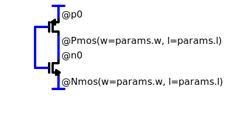

# Hdl21 Schematics 

(Maybe some intro about how & where schematics tend to be useful, and less than useful)


## 1. Schematics are SVGs

* They are not *like* SVGs. They are not *exportable to* SVGs. They *are* SVGs. 
* So: 
  * Anyone can *read* their content. 
    * Including services like GitHub, GitLab, and any computer with a web browser. 
  * *Writing* their content requires some special software. 

So this inverter is a valid schematic: 


(The Comic Sans is a joke, but man it's a funny one.) 

The same inverter with [OpenMoji's mind-blown emoji](https://openmoji.org/library/emoji-1F92F/) is also a valid schematic:


* SVG is an XML-based schema, and allows for semi-custom metadata attached to each element. 
  * This metadata, plus the structure of the document, is what makes an SVG a schematic. 
* SVG schematics will by convention have a sub-file-extension of `.sch.svg`. 
* This also allows for rich, arbitrary annotations and metadata, such as: 
  * Any other custom vector-graphics, e.g. block diagrams
  * Layout intent, e.g. how to position and/or route elements
  * Links to external content, e.g. testbenches, related schematics, etc.


## 2. There are no custom symbols, **and never will be**.

* Schematics consist solely of instances of *primitive* devices, similar to those comprising the primitive libraries of SPICE, Hdl21, and VLSIR. 
  * Examples: transistors, resistors, capacitors, voltage sources, ports. 
  * FIXME: list the compete set, it's not long 
  * They *do not* include higher-level devices. Not even relatively low-level devices such as logic gates. 

The simple rule is:  
**If you want to instantiate anything else, write HDL code.**

* Primitive symbols *do not* correspond to a single particular device. They consist solely of: 
  * The (pretty) picture 
  * A named, located set of terminals 
  * Two string-valued fields, `@name` and `@of` - 
    * `@name` is the instance name, as in Verilog, SPICE, Virtuoso, and most other hardware descriptions. 
    * `@of` determines the type of device.
  * The `@of` field is executed as code. It will often contain parameter values and expressions thereof. To create a valid schematic, the result of evaluating the `@of` field must be - 
    * An Hdl21 `Instantiable`, and 
    * Include the same ports as the symbol 

Examples of valid values of `@of` for the NMOS symbol: 

```python
hdl21.primitives.Nmos(w=1e-6)
```

```python
# Assuming "something" (the code-prelude discussed next) runs something like:
#from asap7 import nmos as my_asap7_nmos

my_asap7_nmos(l=7e-9, w=1e-6)
```

Note: SVG includes a definitions (`<defs>`) section, which in principle can serve as a place to hold the primitive symbol definitions. Doing so would save space in the hypertext content. But we have very quickly found that popular platforms we'd like to have render schematics (ahem, GitHub) do not support the `<defs>` and corresponsing `<use>` elements.


## 3. Schematics are imported as Hdl `Generator`s

* Each schematic includes a "code prelude" - a text section which imports anything the schematic is to use. 
* This prelude is stored in text form as a (non-rendered) SVG element. 
* An example prelude for the inverter above: 

```python
# An example prelude for the inverter schematic

# Import stuff 
import hdl21 as h 
from hdl21.primitives import Nmos, Pmos

# And define a type for its parameters
@h.paramclass 
class Params: 
  w = h.Param(dtype=int, desc="Width")
  l = h.Param(dtype=int, desc="Length")
```



The combination maps to something like the following Python code: 

```python
# Everything in the prelude, plus: 

@h.generator
def inverter(params: Params) -> h.Module:
  inverter = h.Module()
  inverter.n0 = Nmos(w=params.w, l=params.l)(...) 
  inverter.p0 = Pmos(w=params.w, l=params.l)(...) 
  # Both "..."s are where connections, not covered yet, will go. 
  return inverter
```

* Schematic preludes execute as "regular Python code". 
  * All semantics are available
  * Any imports available in the executing environment are available. 

* There will be some flexibility lost in parameterizing graphical schematics, as compared to arbitrary code. Naming conventions fill most of the gap. They include: 
  * The name of the `Generator` is that of the schematic SVG file. 
  * The name of its parameter-type is `Params`. If nothing by this name is defined, the `Generator` will have no parameters. 
  * The name of the parameter-argument to the `Generator` is `params`, with a lower-case `p`. 
    * The latter two follow Python-style naming conventions; `Params` is a type, and `params` is an instance of that type.


---

## How This Works 

The combination requires 2.5 - 3 pieces of software: 

1. **The SVG Schematic Schema**
  * Dictates the metadata used to indicate schematic content, and the structure of other allowable included SVG content.
  * This may be a dedicated piece of software imported and used by the other two, or may be in the form of specifications for them. 
2. **The Python Importer**
  * Imports an SVG schematic into a Hdl21 `Generator`. 
  * Python allows for custom importers, which can be triggered by specific file extensions. Importing a schematic maned `inverter.sch.svg` can therefore be as simple as: 

  ```python
  # Import `inverter.sch.svg` as a Python module with an Hdl21 `Generator`
  from . import inverter 
  ```

3. **The Schematic Editor**
  * Uses popular web technologies to edit the graphical and code-prelude sections of schematics.
  * Desirably runs in a few different contexts: 
    * A dedicated application, written using the Electron framework.
    * Probably most valuably as a VS Code plug-in. 
    * Maybe in the browser as well. Where to store and retrieve schematics becomes the primary differentiator, as the other two contexts have access to the designer's file system. 

The Electron and VS Code plug-in programming models are fairly similar, and should allow for sharing of the overwhelming majority of the editor codebase. Their differences will be where they interact with their underlying platforms: creating windows, opening files, and the like. Both use a message-passing interprocess mechanism to do so, with separate processes for "main" and "rendering". The latter draws the graphical display and handles user input, but has little underling system access, much like a web browser. 


## Status and This Repo 

* [Hdl21SchematicEditor](./[Hdl21SchematicEditor]) contains the prototype editor. 
  * The prototype schema is thus far essentially dictated by this program. 
* A broken-out schema is TBC. 
* The Python importer is TBC. 
