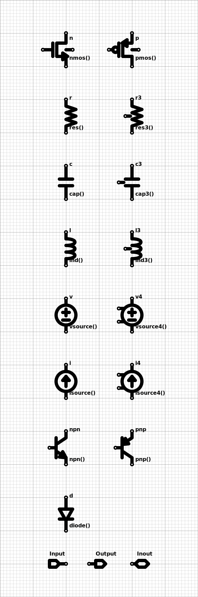

# Hdl21 Schematics

SVG based integrated circuit schematics that seamlessly import and run as [hdl21](https://github.com/dan-fritchman/Hdl21)'s Python-based circuit generators.

---

[Schematics](https://en.wikipedia.org/wiki/Circuit_diagram) are graphical representations of electronic circuits. In integrated circuit (IC, chip, silicon) design they the *lingua franca* for analog circuits, and often used for transistor-level digital circuits.

In short: schematics are two things -

1. A Circuit
2. A Picture

## Hdl21 Schematics are SVG Images

[Scalable Vector Graphics (SVG)](https://developer.mozilla.org/en-US/docs/Web/SVG) is the W3C's open web-standard for two dimensional vector graphics. SVG is an XML-based markup language which all modern browsers natively render, and includes the capacity for semi-custom content structure and metadata.

Hdl21 schematics are not _like_ SVGs.  
They are not _exportable to_ or _convertable to_ SVGs.  
They **are** SVGs. So:

- Each schematic is a _single file_. No dependencies, no "database".
- Anyone can read them.
- GitHub can read them.
- GitLab can read them.
- Grandma's copy of Internet Explorer can read them.

This inverter is a valid schematic:


And the same inverter with [OpenMoji's mind-blown emoji](https://openmoji.org/library/emoji-1F92F/) is also a valid schematic:


This is the first, probably biggest, difference between Hdl21 schematics and any other you've encountered. Instead of defining a custom schematic format and needing custom software to read it, Hdl21 schematics are general-purpose images. Any remotely modern web browser or OS can read them.

Embedding in SVG also allows for rich, arbitrary annotations and metadata, such as:

- Any other custom vector-graphics, e.g. block diagrams
- Layout intent, e.g. how to position and/or route elements
- Links to external content, e.g. testbenches, related schematics, etc.

SVG is an XML-based schema and allows for semi-custom strucutre and metadata.
This structure and metadata, detailed [later in this document](#the-svg-schematic-schema), is what makes an SVG a schematic.

While _reading_ schematics requires any old computer, _writing_ them is best done with custom software. The primary Hdl21 schematics graphical editor runs in three primary contexts:

- On the web
- As a standalone desktop application
- As a VsCode Extension

SVG schematics by convention have a sub-file-extension of `.sch.svg`. The editor application and VsCode Extension use this convention to identify schematics and automatically launch in schematic-edit mode.

## Schematics as Circuits: Hdl21 Generators

[Hdl21](https://github.com/dan-fritchman/Hdl21) is a high-productivity analog hardware description library (HDL) embedded in Python. Hdl21's `Generator`s are Python functions which produce circuit `Module`s. Hdl21 schematics are designed to seamlessly import into Hdl21-based Python programs, as a kind of "graphical Python module".

The inverter pictured above (with or without the emoji) roughly translates to the following Python code:

```python
# A code-prelude, covered shortly, executes here.

@h.generator
def inverter(params: Params) -> h.Module:
  inverter = h.Module()
  inverter.n0 = Nmos(params)(...)
  inverter.p0 = Pmos(params)(...)
  return inverter

# Both "..."s are where connections, not covered yet, will go.
```

Each schematic includes a _code prelude_: a text section which precedes the schematic content. Typically this code-block imports anything the schematic is to use. The prelude is stored in text form as a (non-rendered) SVG element.

An example prelude:

```python
# An example code-prelude
from hdl21.primitives import Nmos, Pmos
```

This minimal prelude imports the `Nmos` and `Pmos` devices from the Hdl21 primitive library.

Schematic preludes execute as "regular" Python code. All of the language's semantics are available, and any module-imports available in the executing environment are available.

To link their code-sections and picture-sections together, Hdl21 schematics require a few naming conventions:

- Each Hdl21 `Generator` has a single typed argument `params`, which is an instance of an Hdl21 `paramclass`.
  - The name of each schematic-generator's parameter-type is `Params`, with a capital `P`.
  - If `Params` is not defined in the code prelude, the `Generator` will have no parameters.
- The name of the _argument_ to the `Generator` function is `params`, with a lower-case `p`.
  - Any references to the parameters by the content of the schematic - such as `Nmos(params)` above - must use this name.
- The name of the schematic generator function is either:
  - If a string-valued `name` attribute is definied in the code-prelude, that name is used for the generator function.
  - If not, the generator function's name is that of the schematic SVG file.
- There is a single reserved identifier in the schematic content: `h` must refer to the Hdl21 pacakge.
  - Think of a "pre-prelude" as running `import hdl21 as h` before the code-prelude.
  - Overwriting the `h` identifier will produce an import-time Python error.
  - Re-importing `hdl21 as h` is fine, as is importing `hdl21` by any additional names.

The parameter-naming follows Python-style naming conventions; `Params` is a type, and `params` is an instance of that type.

An example code-prelude with a custom `Params` type:

```python
# An example code-prelude, using devices from PDK-package `mypdk`
import hdl21 as h
from mypdk import Nmos, Pmos

@h.paramclass
class Params:
  w = h.Param(dtype=int, desc="Width")
  l = h.Param(dtype=int, desc="Length")
```

## The Element Library

Schematics consist of instances of primitive elements, ports, and wire connections there-between. The primitive-elements library holds similar content to that of SPICE: transistors, resistors, capacitors, voltage sources, and the like.

The complete element library:



Symbols are technology agnostic. They do not correspond to a particular device from a particular PDK. Nor to a particular device-name in an eventual netlist. Symbols solely dictate:

- How the element looks in the "schematic picture"
- The port list

Each instance includes two string-valued fields: `name` and `of`.

The `name` string sets the instance name. This is a per-instance unique identifier, directly analogous to those in Verilog, SPICE, Virtuoso, and most other hardware description formats. It must be of nonzero length, and for successful Python import it must be a valid Python-language identifier.

The `of` string determines the type of device. In Python, the `of` field is executed as code. It will often contain parameter values and expressions thereof.

Examples of valid `of`-strings for the NMOS symbol:

```python
from hdl21.prefix import µ, n
from hdl21.primitives import Nmos
# Of-string:
Nmos(w=1*µ, l=20*n)

# In the code prelude:
from asap7 import nmos as my_asap7_nmos
# Of-string:
my_asap7_nmos(l=7e-9, w=1e-6)
```

This is probably the second biggest difference between Hdl21 schematics and most other schematic systems. There is no backing "database", no "links" to out-of-source libraries. The types of all devices are dictated by code-strings, interpreted by programs ingesting the schematic.

For a schematic to produce a valid Hdl21 generator, the result of evaluating each instance's `of` field must be:

- An Hdl21 `Instantiable`, and
- Include the same ports as the symbol

---

### On Hierarchy

The experienced schematic-author may by now be wondering: how does one make _hierarchical_ Hdl21 schematics, with custom subcircuit cells and symbols?

The answer is simple: you don't.  
**Write HDL code instead.**

### There are no custom symbols. On purpose. **And there never will be.**

---

## Installation

Reading SVG schematics requires no special software or installation: if your browser can display SVG, you can read schematics. Double-click on them or open them with the OS-native method of your choice. Voila.

The schematic editor has two "platforms" for installation: its dedicated desktop application, and its VsCode extension.  
As of this writing both require from-source installation and execution.

Prerequisites:

- Install the JavaScript package manager [Yarn](https://classic.yarnpkg.com/en/docs/install)
  - MacOS: [Homebrew](https://brew.sh/) makes this particularly easy: https://formulae.brew.sh/formula/yarn
  - Debian:
    - Install `npm` and `node` through `apt`: `sudo apt install nodejs npm`
    - Update `node` through `npm`: `sudo npm install -g n && sudo n stable`
  - (FIXME: add any recommendations for other OSes - or just stick with Yarn's docs.)
- Clone this repository
  - `git clone git@github.com:Vlsir/Hdl21Schematics.git`

To start the desktop application:

- `cd Hdl21Schematics/Hdl21SchematicEditor/packages/EditorApp`
- `yarn` to install dependencies
- `yarn start` to start the application

To start the VsCode plugin: (FIXME! mumble mumble about its debugger etc.)

---

## How This Works

The combination requires 2.5 - 3 pieces of software:

1. **The SVG Schematic Schema**

- Dictates the metadata used to indicate schematic content, and the structure of other allowable included SVG content.
- This may be a dedicated piece of software imported and used by the other two, or may be in the form of specifications for them.

2. **The Python Importer**

- Imports an SVG schematic into a Hdl21 `Generator`.
- Python allows for custom importers, which can be triggered by specific file extensions. Importing a schematic maned `inverter.sch.svg` can therefore be as simple as:

```python
# Import `inverter.sch.svg` as a Python module with an Hdl21 `Generator`
from . import inverter
```

3. **The Schematic Editor**

- Uses popular web technologies to edit the graphical and code-prelude sections of schematics.
- Desirably runs in a few different contexts:
  - A dedicated application, written using the Electron framework.
  - Probably most valuably as a VS Code plug-in.
  - Maybe in the browser as well. Where to store and retrieve schematics becomes the primary differentiator, as the other two contexts have access to the designer's file system.

The Electron and VS Code plug-in programming models are fairly similar, and should allow for sharing of the overwhelming majority of the editor codebase. Their differences will be where they interact with their underlying platforms: creating windows, opening files, and the like. Both use a message-passing interprocess mechanism to do so, with separate processes for "main" and "rendering". The latter draws the graphical display and handles user input, but has little underling system access, much like a web browser.

## Status and This Repo

- [Hdl21SchematicEditor](./[Hdl21SchematicEditor]) contains the schematic editor. It is broken in several components, organized as JavaScript packages:
  - [EditorCore](./Hdl21SchematicEditor/packages/EditorCore/) provides the core editor functionality.
  - [EditorApp](./Hdl21SchematicEditor/packages/EditorApp/) exposes the editor as a standalone desktop application, using the Electron framework.
  - [VsCodePlugin](./Hdl21SchematicEditor/packages/VsCodePlugin/) exposes the editor as a VS Code plug-in.
  - A web-based environment for the editor is also possible, and is TBC.
- [Hdl21SchematicImporter](./[Hdl21SchematicImporter]) contains the Python importer.
- A broken-out schema is TBC.
  - The prototype schema is thus far dictated by the Python and JavaScript implementations of the [editor](./Hdl21SchematicEditor) and [importer](./Hdl21SchematicImporter).

## The SVG Schematic Schema

SVG schematics are generally interpreted by two categories of programs:

- (1) General-purpose image renderers such as Google Chrome, Firefox, and InkScape, which comprehend schematics _as pictures_.
- (2) Special-purpose programs which comprehend schematics _as circuits_. This category notably includes the primary Python importer.

This section serves as the specification for (2). The schema which dictates the content of _schematic circuits_ is dictated through SVG structure and element attributes. While some of this schema also dictates how schematics appear _as pictures_, overlap between the two use-cases is incomplete. Valid schematic importers must adhere to the schema defined herein and no more.

Note the graphical schematic _editor_ is a special case which combines _both_ use-cases. It simultaneously renders schematics as pictures while being drawn and dictates their content as circuits. The graphical editor holds a number of additional pieces of non-schema information about schematics and how they are intended to be rendered as pictures, including their style attributes, design of the primitive symbols, and locations of text annotations. This information _is not_ part of the schematic schema. Any valid SVG value for these attributes is to be treated as valid by schematic importers.

### `Schematic`

#### SVG Root Element

Each `Schematic` is represented by an SVG element beginning with `<svg>` and ending with `</svg>`, commonly stored in a file with the `.sch.svg` extension.

Many popular SVG renderers expect `?xml` prelude definitions and `xmlns` (namespace) attributes to properly render SVG. SVG schematics therefore begin and end with:

```svg
<?xml version="1.0" encoding="utf-8"?>
<svg width="1600" height="800" xmlns="http://www.w3.org/2000/svg">
  <!-- Content -->
</svg>
```

These XML preludes _are not_ part of the schematic schema, but _are_ included by the graphical editor.

#### Size

Schematics are always rectangular. Each schematic's size is dictated by its `svg` element's `width` and `height` attributes. If either the width or height are not provided or invalid, the schematic shall be interpreted as having the default size of 1600x800.

#### Schematic and Non-Schematic SVG Elements

SVG schematics allow for inclusion of arbitrary _non-schematic_ SVG elements. These might include annotations describing design intent, links to related documents, logos and other graphical documentation, or any other vector graphics content.

These elements _are not_ part of the schematic content. Crucially circuit importers must (a) categorize each element as being either schematic or not, and (b) ignore all elements which are non-schematic content.

#### Header Content

SVG schematics include a number of header elements which aid in their rendering as pictures. These elements _are not_ part of the schematic schema, and are to be ignored by schematic importers.

#### Schematic Content

Each `Schematic` is comprised of collections of four types of elements:

- `Instance`s of primitive elements
- `Wire`s connecting them
- `Port` annotations
- `Dot`s dictating located connections, where connectivity would otherwise be ambiguous

These collections are not ordered or named. No element refers to any other by any means, e.g. name or ID.

The following sections detail each type of schematic element. First, two facets which apply to all schematic elements: the coordinate system and the allowable element orientations.

#### Coordinates

SVG schematics use the SVG and web standards for their coordinate system. The origin is at the top-left corner of the schematic, with the x-axis increasing to the right and the y-axis increasing downward.

All schematic coordinates are stored in SVG pixel values. Schematics elements are placed on a coarse grid of 10x10 pixels. All locations of each element within a schematic must be placed on this grid.

NOTE: handling of invalid coordinates. Rounding vs errors.

#### Orientation

All schematic elements operate on a "Manhattan style" orthogonal grid. Orient-able elements such as `Instance`s and `Port`s are similarly allowed rotation solely in 90 degree increments. Such elements may thus be oriented in a total of _eight_ distinct orientations: four 90 degree rotations, with an optional flip. Reflection and rotation of these elements are both applied about their origin locations.

These orientations are translated to and from SVG `transform` attributes. SVG schematics use the `matrix` transform to capture the combination of orientation and location.

FIXME: worth using `translate`/`rotate`/`scale` instead? https://developer.mozilla.org/en-US/docs/Web/SVG/Tutorial/Basic_Transformations

### `Instance`

Each `Instance` includes:

- A string instance `name`
- A string `of`, which dictates the type of element to be instantiated
- A `kind` value from the enumerated `Primitives` list, which serves as pointer to the `Primitive` dictating its pictorial symbol and port list.
- A `location` dictating the position of its origin in schematic coordinates.
- An `orientation` dictating its reflection and rotation.

In SVG, each instance is represented by a group (`<g>`) element. Instance groups are identified by their use of the `hdl21-instance` SVG class. The location and orientation of each instance is stored in its instance-group's `transform` attribute.

Each instance-group holds three ordered child elements:

- Another group (`<g>`) holding the instance's pictorial symbol.
  - The SVG `class` of this symbol-group serves as indication of the `kind` of the instance.
  - The _content_ of the symbol-group is not part of the schematic schema. Any valid SVG content is allowed. The schema dictates only that the `class` attribute indicate the `kind` of the instance.
- A `<text>` element with class `hdl21-instance-name` holding the instance's name.
- A `<text>` element with class `hdl21-instance-of` holding the instance's `of` string.

An example `Instance`:

```svg
<g class="hdl21-instance" transform="matrix(1 0 0 1 X Y)">
    <g class="hdl21::primitives::nmos">
        <!-- Content of the symbol -->
    </g>
    <text x="10" y="0" class="hdl21-instance-name">inst_name</text>
    <text x="10" y="80" class="hdl21-instance-of">inst_of</text>
</g>
```

The lack of valid values for any of the three child elements makes an instance invalid. The three child elements are required to be stored in the order (symbol, name, of).

### Primitive Elements

SVG schematics instantiate "primitive" devices from a library of pre-defined symbols. A schematic importer must be aware of this libray's contents, as it dictates much of the schematic's connectivity.

The `kind` field of each `Instance` serves as a reference to a `Primitive` type. Each `Primitive` consists of:

- The symbol "picture", and
- A list of named, located ports

An example `Primitive`, defined in JavaScript syntax:

```js
Primitive({
  kind: PrimitiveKind.Nmos,
  svgLines: `
    <g class="hdl21::primitives::nmos">
        <!-- ... -->
    </g>
    `,
  ports: [
    new Port({ name: "d", loc: point(0, 0) }),
    new Port({ name: "g", loc: point(70, 40) }),
    new Port({ name: "s", loc: point(0, 80) }),
    new Port({ name: "b", loc: point(-20, 40) }),
  ],
});
```

The SVG schematic primitives largely mirror those of SPICE. Notably each primitive _does not_ dictate that a particular device appear in an ultimate circuit. The `of` string of each `Instance` dictates these choices. The primitive solely dictates its two fields: the pictorial symbol and the port list.

FIXME: examples

FIXME: the full primitive library

### `Wire`

Schematic wires consist of orthogonal Manhattan paths. They are represented by SVG group (`<g>`) elements, principally including an internal `<path>` element. Wire groups are indicated by their use of the `hdl21-wire` SVG class. Each wire group has two child elements:

- The `path` element dictating the wire's shape.
- A `text` element dictating its wire name/ connectivity.
  - FIXME: handling of wire naming is in some flux; save this section for later.

An example `Wire`:

```svg
<g class="hdl21-wire">
    <path class="hdl21-wire" d="M 170 150 L 200 150 L 200 350 L 190 350 L 170 350" />
    <text class="hdl21-wire-name">net1</text>
</g>
```

Wire vertices are dictated by the SVG `path`'s `d` attributes. Each wire vertex must be located on the schematic's 10x10 pixel grid. Each wire segment must meet "Manhattan" orthogonal routing style, i.e. each point must have either an x or y coordinate equal to that of the previous point. Wire paths are _open_ in the SVG sense; there is no implicit segment from the final point back to the first.

### `Port`

Schematic `Port`s appear similar to `Instance`s in both pictorial representation and in SVG content. Unlike instances they do not add hardware to the circuit represented by the schematic, but annotate particular `Wire`s as being exposed externally.

Each `Port` has the following fields:

- A string `name`
- A `kind` value from the enumerated `PortKind` list
- A `location` dictating the position of its origin in schematic coordinates.
- An `orientation` dictating its reflection and rotation.

Note these fields are identical to those of `Instance`, but for the removal of the `of` string-field. The semantic content of a schematic `Port` is dicated fully by its `Kind` field, which also dictates its pictorial representation.

In SVG, each `Port` is represented by a group (`<g>`) element. Port groups are identified by their use of the `hdl21-port` SVG class. The location and orientation of each instance is stored in its port-group's `transform` attribute.

Each port-group holds two ordered child elements:

- Another group (`<g>`) holding the port's pictorial symbol.
  - The SVG `class` of this symbol-group serves as indication of the `kind` of the port.
  - The _content_ of the symbol-group is not part of the schematic schema. Any valid SVG content is allowed. The schema dictates only that the `class` attribute indicate the `kind` of the port.
- A `<text>` element with class `hdl21-port-name` holding the port's name.

An example `Port`:

```svg
<g class="hdl21-port" transform="matrix(1 0 0 1 X Y)">
    <g class="hdl21::ports::input">
        <!-- Content of the symbol -->
    </g>
    <text x="10" y="-15" class="hdl21-port-name">portname</text>
</g>
```

FIXME: naming rules for ports vs wires

### Connection `Dot`

Schematic dots indicate connectivity between wires and ports where connections might otherwise be ambiguous. The inclusion of a `Dot` at any location in a schematic implies that all `Wire`s passing through that point are connected. The lack of a `Dot` at an intersection between wires conversely implies that the two _are not_ connected, and instead "fly" over one another.

`Dot`s are represented in SVG by `<circle>` elements centered at the dot location. Dot locations must land on the 10x10 pixel schematic grid. Dot-circles are identified by their use of the `hdl21-dot` SVG class.

An example `Dot`:

```svg
<circle cx="-20" cy="40" class="hdl21-dot" />
```

The center location dictating `cx` and `cy` attributes are the sole schema-relevant attributes of a dot-circle. All other attributes such as the radius `r` are not part of the schema, and may be any valid SVG value.

While serving as powerful visual aids, `Dot`s _do not_ have semantic meaning in schematics. They are entirely a visual aid. Schematic importers _shall not_ imbue them with meaning, i.e. any valid schematic with any combination of `Dot`s yields an identical circuit with _any other_ combination of `Dot`s.

The primary editor application infers `Dot`s at load time, and uses those stored in SVG as a check. This process includes:

- Running "dot inference" from the schematic's wires, instances, and ports
- Comparing the inferred dot locations with those stored in the SVG
- If the two differ, reporting a warning to the user

Differences between the inferred and stored dot locations _do not_ cause the schematic to fail to load. The editor will simply report the difference to the user and display the inferred dots.

---

Note: SVG includes a definitions (`<defs>`) section, which in principle can serve as a place to hold the primitive symbol definitions. Doing so would save space in the hypertext content. But we have very quickly found that popular platforms we'd like to have render schematics (ahem, GitHub) do not support the `<defs>` and corresponsing `<use>` elements.

---

Broader FIXMEs:

- General philosophy on error handling
  - Rejection of individual elements, vs the whole schematic, vs trying to "fix" things inline
- Wire vs port naming & connection rules
- Add the remaining Primitives
- Add the code prelude!

